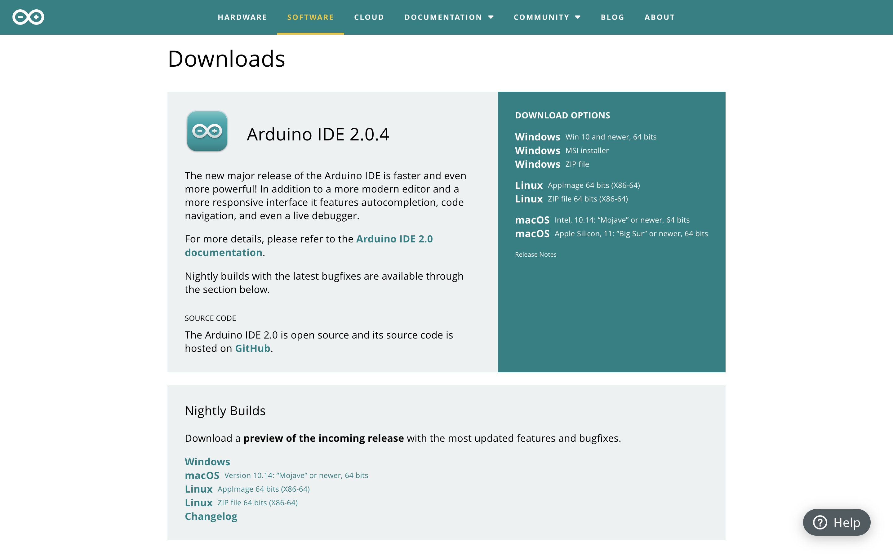

# IDE Setup for ESP32 – *ParkMate Smart Parking System*

## Why ESP32 for ParkMate?
---
ParkMate relies on IoT devices to **detect cars, manage parking occupancy, and integrate with gates and cameras**.  
The ESP32 microcontroller is the backbone of our hardware setup, handling:

- **Ground Sensors** (magnetic/ultrasonic) to detect car presence.  
- **Overhead Cameras with AI modules** for plate recognition and spot monitoring.  
- **Gate/Barrier Controllers** to verify entry/exit based on reservations.  
- **Smart Meters** to link parking usage with digital payments.  

To program the ESP32 and deploy these modules, we use the **Arduino IDE**. This guide shows you how to set it up.

---

## Installing the ESP32 Board in Arduino IDE (Windows, Mac OS X, Linux)

The Arduino IDE supports the ESP32 through an add-on.  
This allows ParkMate developers to easily prototype and deploy parking-related firmware.  

If you face issues, check the [ESP32 Troubleshooting Guide](https://randomnerdtutorials.com/esp32-troubleshooting-guide/).

---

### Step 1: Install Arduino IDE

Download and install Arduino IDE:  
👉 [https://www.arduino.cc/en/software](https://www.arduino.cc/en/software)

- Choose IDE version 1.x or 2.x depending on your OS.  
- (For this project, we recommend IDE 2.x for better support and debugging).

---

### Step 2: Install ESP32 Board on Arduino IDE

1. Open **File > Preferences**.  
2. Paste this URL into **Additional Board Manager URLs**:

https://raw.githubusercontent.com/espressif/arduino-esp32/gh-pages/package_esp32_index.json

3. Hit **OK**.  
4. Then open **Tools > Board > Boards Manager…**  
5. Search for **ESP32 by Espressif Systems** and install it.

---

### Step 3: Test the Installation (ParkMate Example)

Now let’s test if the ESP32 works properly before integrating parking sensors.

1. Plug the ESP32 board into your PC.  
2. Select the board under **Tools > Board** (for example, "ESP32 DevKit v1").  
3. Select the correct **Port**.  
4. Open the example **File > Examples > WiFi (ESP32) > WiFiScan**.  
5. Upload the sketch.

If everything works, you’ll see nearby WiFi networks in the Serial Monitor at **115200 baud rate**.

This confirms the ESP32 is ready for ParkMate deployments.

---

## Next Steps – Connecting ParkMate Modules

Once the ESP32 environment is ready, we move on to integrating our IoT devices:

- **Parking Spot Sensors** → Send occupancy data to the central server.  
- **Gate Control** → Open/close based on mobile reservation validation.  
- **Camera Module (ESP32-CAM)** → Recognize license plates.  
- **Payment Link (via Smart Meters & ESP32 WiFi)** → Real-time billing.  

Each of these modules will run dedicated ESP32 sketches, all manageable from the Arduino IDE.

---

📌 **This guide ensures every developer in the ParkMate project can prepare their ESP32 to start building smart parking IoT modules.**
